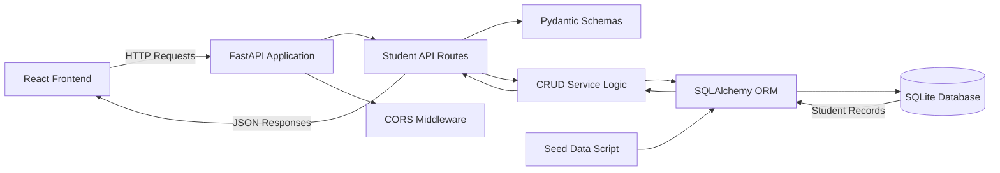
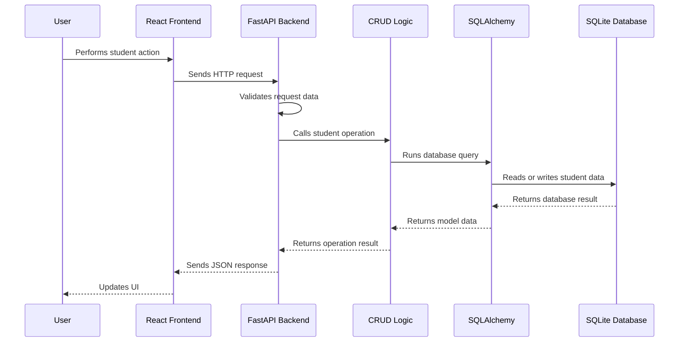

# Backend Architecture Diagram

## Purpose

This document shows the planned backend architecture for the Student Management System.

The backend will receive requests from the React frontend, process CRUD operations using FastAPI, interact with the SQLite database through SQLAlchemy, and return JSON responses.

## Backend Architecture

## Component Responsibilities

### React Frontend

- Sends requests to the backend API
- Displays student records
- Provides forms for adding and updating students
- Sends delete requests for removing students

### FastAPI Application

- Starts the backend server
- Registers API routes
- Configures middleware
- Provides automatic API documentation

### Student API Routes

- Defines CRUD endpoints
- Receives requests from the frontend
- Calls backend CRUD logic
- Returns JSON responses

### Pydantic Schemas

- Validates incoming request data
- Defines response data shape
- Helps keep API input and output consistent

### CRUD Service Logic

- Contains reusable student database operations
- Handles create, read, update, and delete behavior
- Keeps route files cleaner

### SQLAlchemy ORM

- Maps Python classes to database tables
- Handles database queries
- Manages communication with SQLite

### SQLite Database

- Stores student records locally
- Contains the `students` table
- Starts with 10 seeded student records

### Seed Data Script

- Adds initial student records
- Helps test the backend quickly
- Avoids starting with an empty database

### CORS Middleware

- Allows the React frontend to call backend APIs
- Supports local frontend development on `http://localhost:5173`

## Planned Backend Request Flow

## Backend Boundary

This document describes backend structure only. Frontend screen design and frontend component structure will be documented separately.

