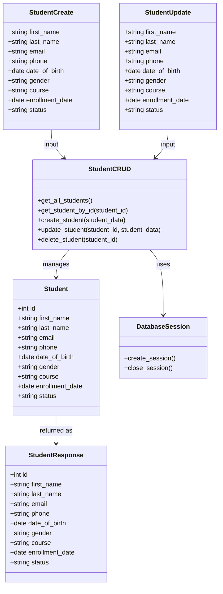

# Backend Class Diagram

## Purpose

This document shows the planned backend classes and data structures for the Student Management System.

The backend will use a SQLAlchemy model for database mapping and Pydantic schemas for request and response validation.

## Backend Class Diagram

## Class Responsibilities

### Student

The SQLAlchemy model that represents the `students` database table.

Responsibilities:

- Define student table columns
- Map Python attributes to database fields
- Represent saved student records

### StudentCreate

The Pydantic schema used when creating a new student.

Responsibilities:

- Validate new student request data
- Require all fields needed for student creation
- Prevent invalid data from reaching database logic

### StudentUpdate

The Pydantic schema used when updating an existing student.

Responsibilities:

- Validate updated student request data
- Define which fields can be changed
- Support update operations through the API

### StudentResponse

The Pydantic schema used when returning student data from the API.

Responsibilities:

- Define response format
- Include the generated student `id`
- Keep API responses consistent

### DatabaseSession

The database session helper used by FastAPI routes and CRUD logic.

Responsibilities:

- Create database sessions
- Provide sessions to route handlers
- Close sessions after requests complete

### StudentCRUD

The reusable CRUD logic layer for student operations.

Responsibilities:

- Read student records
- Create student records
- Update student records
- Delete student records
- Handle missing records

## Notes

- `Student` is the database model.
- `StudentCreate`, `StudentUpdate`, and `StudentResponse` are validation and serialization schemas.
- `StudentCRUD` is not necessarily a single class in code. It may be implemented as reusable functions depending on the final backend structure.

