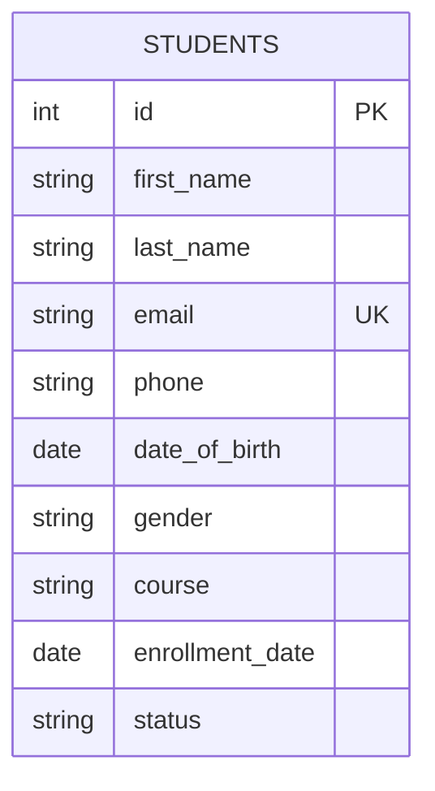

# Backend Database Design

## Purpose

This document defines the planned SQLite database structure for the Student Management System backend.

The backend will use SQLAlchemy to communicate with SQLite.

## Database Choice

SQLite is selected for the first version of this project.

Reasons:

- Simple local setup
- No separate database server required
- Good for learning and small CRUD applications
- Easy integration with FastAPI and SQLAlchemy

## Database File

Planned database file:

```text
students.db
```

Planned database URL:

```text
sqlite:///./students.db
```

## Tables

The backend will use one main table:

```text
students
```

## Students Table

| Column | Type | Required | Unique | Description |
| --- | --- | --- | --- | --- |
| `id` | Integer | Yes | Yes | Primary key |
| `first_name` | String | Yes | No | Student first name |
| `last_name` | String | Yes | No | Student last name |
| `email` | String | Yes | Yes | Student email address |
| `phone` | String | Yes | No | Student phone number |
| `date_of_birth` | Date | Yes | No | Student date of birth |
| `gender` | String | Yes | No | Student gender |
| `course` | String | Yes | No | Course or program name |
| `enrollment_date` | Date | Yes | No | Student enrollment date |
| `status` | String | Yes | No | Student status |

## Entity Relationship Diagram



## Data Rules

### Primary Key

The `id` column will uniquely identify each student record.

### Unique Email

The `email` column should be unique so duplicate student email addresses are not allowed.

### Required Fields

All student fields are required in the first version of the system.

### Status Values

Planned status values:

- `Active`
- `Inactive`
- `Graduated`

## Seed Data Plan

The database will start with 10 sample student records.

Seed data should include realistic values for:

- Names
- Email addresses
- Phone numbers
- Birth dates
- Gender
- Course names
- Enrollment dates
- Status values

## Planned Seed Records

| First Name | Last Name | Email | Course | Status |
| --- | --- | --- | --- | --- |
| Aarav | Sharma | aarav.sharma@example.com | Computer Science | Active |
| Priya | Nair | priya.nair@example.com | Information Technology | Active |
| Rahul | Verma | rahul.verma@example.com | Mechanical Engineering | Active |
| Sneha | Iyer | sneha.iyer@example.com | Electronics | Active |
| Arjun | Patel | arjun.patel@example.com | Civil Engineering | Inactive |
| Meera | Rao | meera.rao@example.com | Computer Science | Active |
| Kiran | Das | kiran.das@example.com | Data Science | Active |
| Ananya | Menon | ananya.menon@example.com | Information Technology | Graduated |
| Vikram | Singh | vikram.singh@example.com | Electronics | Active |
| Fatima | Khan | fatima.khan@example.com | Data Science | Active |

## Database Operations

The backend will support:

- Create a student record
- Read all student records
- Read one student record by ID
- Update a student record
- Delete a student record

## Future Database Improvements

Possible future improvements:

- Move from SQLite to PostgreSQL
- Add course table
- Add attendance table
- Add grades table
- Add user authentication tables
- Add audit timestamps such as `created_at` and `updated_at`

