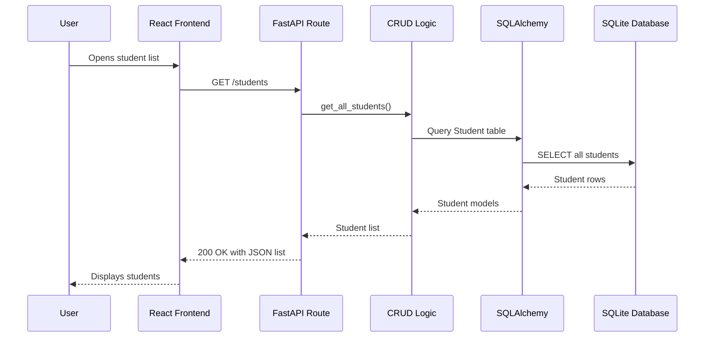
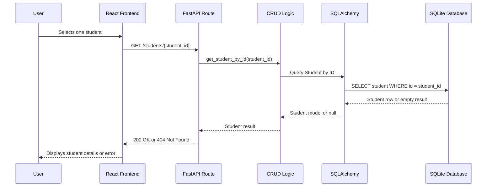
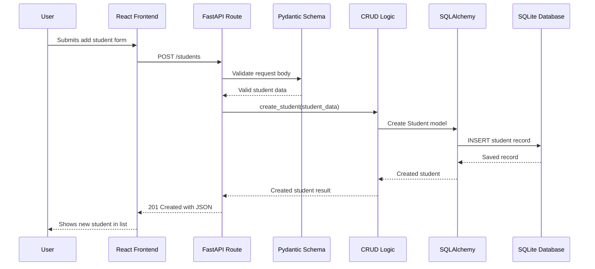
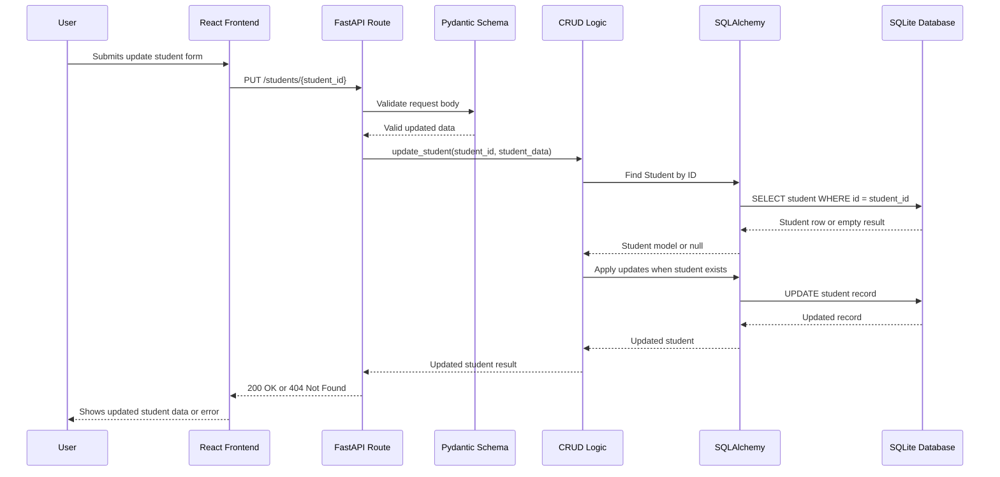
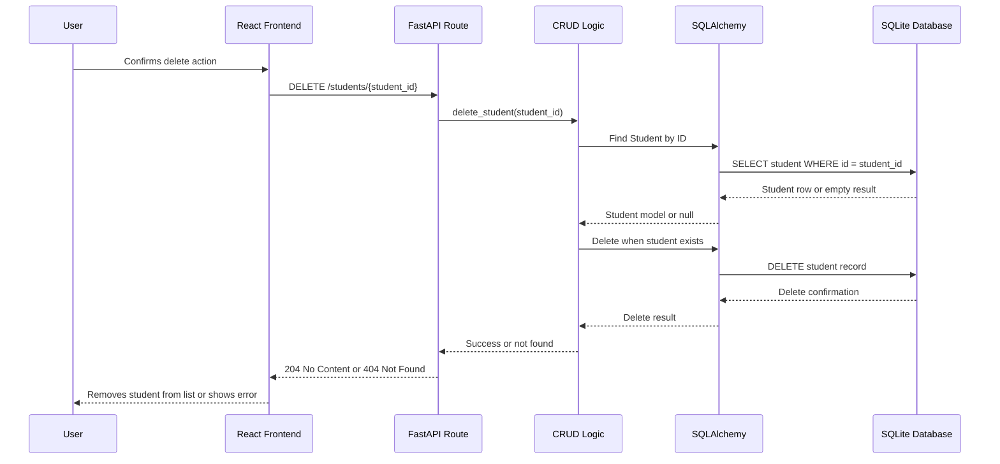
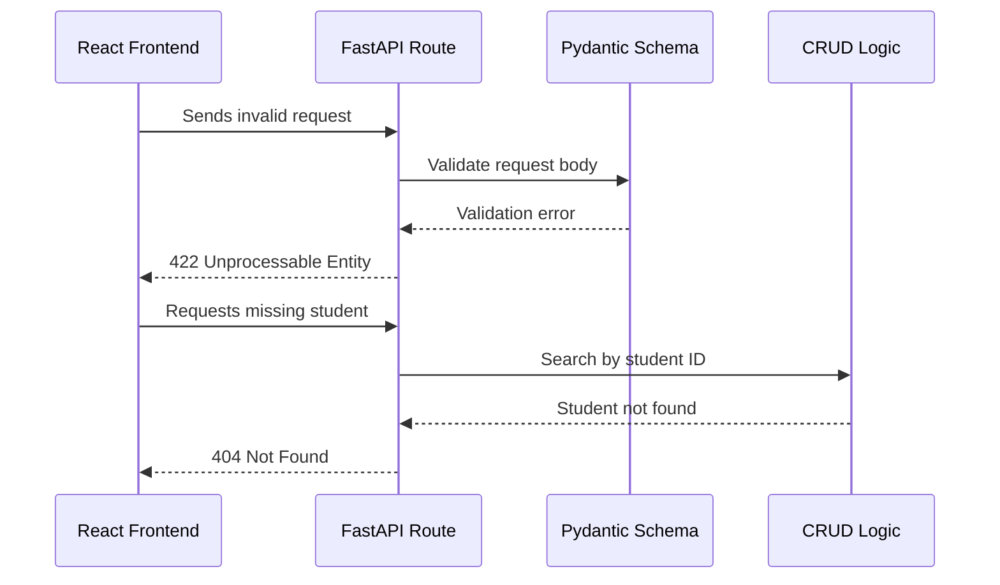

# Backend Sequence Diagram

## Purpose

This document shows the backend request flow for student CRUD operations.

The sequence diagrams explain how the React frontend communicates with the FastAPI backend, how the backend validates data, and how SQLAlchemy interacts with the SQLite database.

## View All Students

## View Student Details

## Add Student

## Update Student

## Delete Student

## Error Handling Flow

