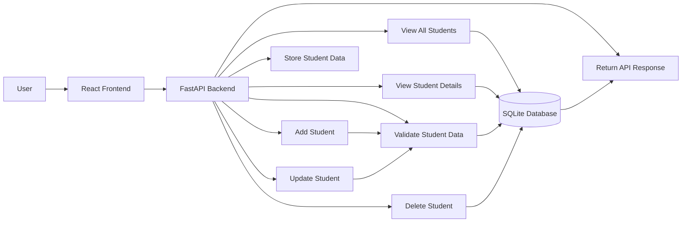

# Backend Use Case Diagram

## Purpose

This document shows the backend use cases for the Student Management System.

The backend supports student CRUD operations only. Authentication, authorization, and login features are not included.

## Backend Use Case Diagram

## Backend Actors

### User

The person using the Student Management System through the React frontend.

### React Frontend

The frontend application that sends HTTP requests to the FastAPI backend.

### FastAPI Backend

The backend system that receives requests, validates data, performs CRUD logic, and communicates with the database.

### SQLite Database

The database that stores student records.

## Backend Use Cases

### View All Students

The backend returns a list of all student records stored in the database.

### View Student Details

The backend returns one student record based on the provided student ID.

### Add Student

The backend receives new student data, validates it, and stores it in the database.

### Update Student

The backend receives updated student data, validates it, and updates the matching student record.

### Delete Student

The backend deletes an existing student record based on the provided student ID.

### Validate Student Data

The backend checks incoming student data before saving or updating records.

Validation includes:

- Required fields
- Email format
- Unique email rule
- Valid date values

### Store Student Data

The backend uses SQLAlchemy to write student records into the SQLite database.

### Return API Response

The backend returns JSON responses to the frontend after each operation.

## Out of Scope

The following features are not part of this backend version:

- User login
- Authentication
- Authorization
- Role management
- File upload
- Attendance management
- Grade management
- Payment management

